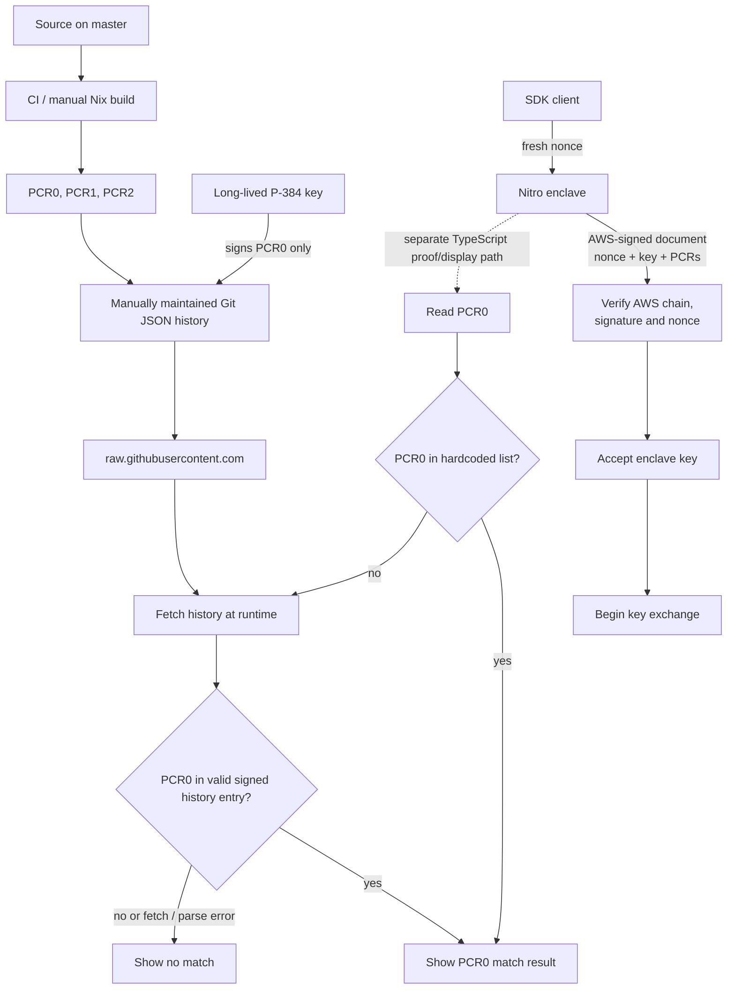
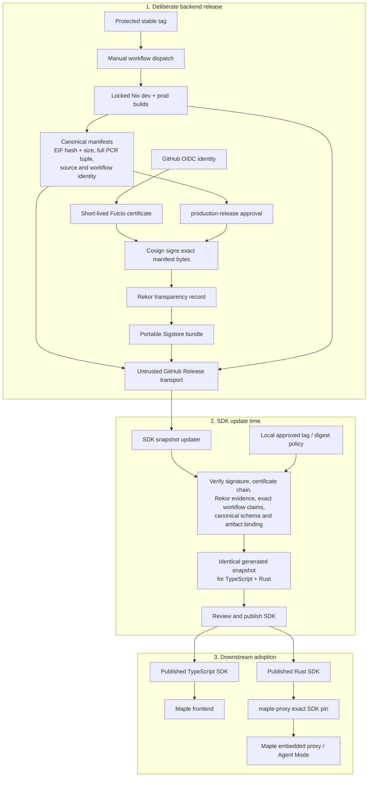
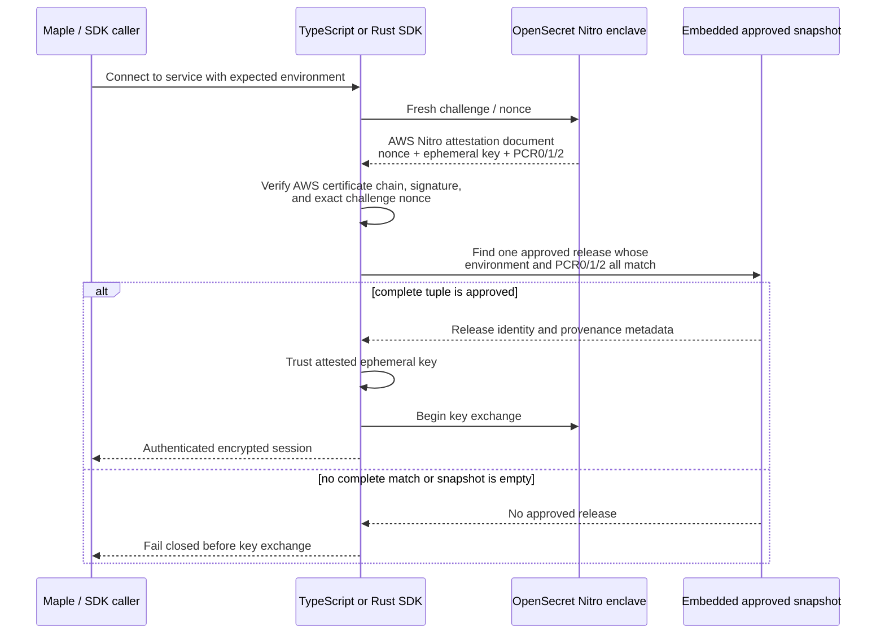
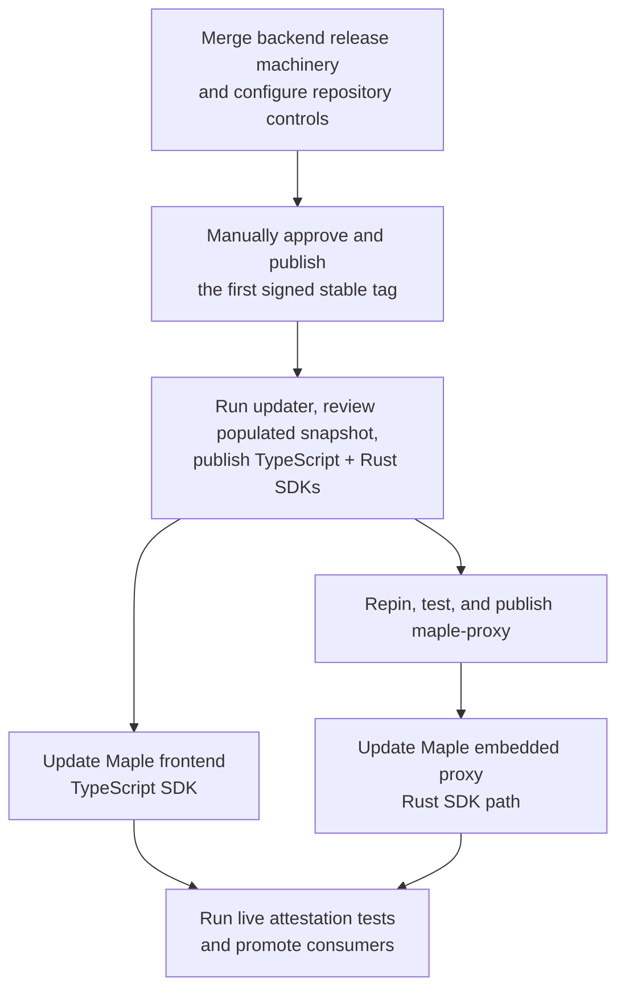

# Nitro EIF Release Verification

OpenSecret publishes AWS Nitro EIF measurements at deliberate, manually approved
release boundaries. Each release contains deterministic manifests signed
keylessly by the tagged GitHub Actions workflow and recorded in Sigstore's
transparency infrastructure.

Sigstore is the provenance and transparency layer. It is not the artifact
transport, a software-safety oracle, a reproducibility proof, a revocation
service, or a source of truth for the newest approved release.

## The Short Version

The old release metadata could answer, "Does this enclave's PCR0 appear in a
hardcoded list or a JSON history fetched from GitHub?" More importantly, that
PCR0 check did not gate the normal TypeScript key exchange, and the normal Rust
client supplied no expected-PCR policy. The new design makes release
authorization part of the security gate and asks a stronger, compound
question:

> Did the expected, manually approved, tag-only OpenSecret release workflow
> sign this exact canonical manifest; was that signature publicly witnessed;
> does the manifest bind the tagged source to this exact EIF and complete
> PCR0/PCR1/PCR2 tuple; is this release locally approved for the requested
> environment; and does a fresh Nitro attestation present that same tuple
> before its session key is trusted?

Sigstore does not store the EIF or act as a package registry. GitHub Releases
still transports the EIF, manifest, and verification bundle. Those downloads
are treated as untrusted bytes. Sigstore makes the manifest independently
verifiable by binding its exact bytes to a short-lived GitHub Actions identity
and an append-only transparency-log record.

The SDKs do not contact GitHub, Fulcio, or Rekor during an application
handshake. A maintainer runs the SDK snapshot updater at release/update time;
it verifies the downloaded Sigstore evidence and embeds the resulting approved
release records into TypeScript and Rust. Runtime verification is therefore
offline, deterministic, and unavailable network services cannot cause a
fallback to weaker trust data.

## Before and After

| Concern | Before | Now | Security effect |
| --- | --- | --- | --- |
| Release boundary | Ordinary builds ran on `master` pushes, pull requests, and manual runs; trusted history changed through a manual Git update | An existing stable `vMAJOR.MINOR.PATCH` tag, manually dispatched through the `production-release` environment after its external protections are configured | Production trust changes become deliberate review events |
| Signer | One long-lived custom P-384 private key | One short-lived keyless certificate issued for the exact tagged GitHub Actions workflow through GitHub OIDC and Fulcio | No repository signing key needs to be stored or rotated |
| Signed statement | Only the PCR0 string | Exact canonical manifest bytes binding source tag and commit, repository IDs, environment, build derivation, EIF SHA-256 and size, PCR0/PCR1/PCR2, and workflow run attempt | A valid signature cannot be transplanted to another artifact, environment, tuple, or build |
| Public audit trail | Mutable Git history | Sigstore bundle with Rekor transparency evidence | Signing events are independently witnessed and tamper-evident |
| Client input | Hardcoded PCR0 lists were checked first; an unmatched PCR0 caused a runtime download of mutable `raw.githubusercontent.com` history | Reviewed, Sigstore-verified snapshot embedded identically in TypeScript and Rust | Runtime has no GitHub dependency and errors fail closed |
| Enclave policy | TypeScript checked PCR0 later in its display path; the normal Rust client supplied no expected PCR map | Atomic same-release PCR0/PCR1/PCR2 match for an explicitly selected environment in both languages | Measurement authorization becomes mandatory rather than informational |
| Origin binding | Environment could be inferred by trying both lists | Known service origins map to exactly one environment; unknown remote origins require an explicit choice | A development measurement cannot satisfy a production connection |
| Key acceptance | A valid AWS Nitro document and nonce were enough for the normal handshake to accept the attested key | Nitro document, nonce, environment, full tuple, and approved release are checked before accepting the enclave key or starting key exchange | A genuine but unapproved Nitro enclave cannot receive secrets |
| Reproducibility | Nix build existed but was not bound to a signed release statement | Locked Nix inputs and derivation metadata are bound into the manifest; independent rebuilding remains a separate check | Provenance and reproducibility evidence can be compared without conflating them |
| Rollback | Old entries remained usable | Old signed entries also remain cryptographically valid; the embedded approved snapshot supplies the current local policy | Sigstore improves history integrity but does not itself solve rollback or revocation |

### Previous Flow



PCR1, PCR2, the source commit, build identity, and actual EIF digest were not
covered by the legacy signature. Git authenticated changes only as ordinary
repository history; it did not provide a separately witnessed append-only
signing record. The diagram's dashed path is the most consequential old
boundary: TypeScript displayed a PCR0 result after the key had already been
accepted, while the normal Rust path did not install a PCR allowlist.

### New Release and Distribution Flow



The signing job can obtain an OIDC identity but cannot write a GitHub Release.
The separate publishing job can write the Release but cannot obtain an OIDC
identity. It re-verifies the candidate before publication. This separation
reduces the authority held by either job.

### New Runtime Handshake



This creates two distinct verification moments:

1. **Update time:** verify who released the software and which exact artifact
   and measurements they released.
2. **Connection time:** verify which software measurement is running now and
   that the presented session key belongs to that fresh attestation.

Neither moment substitutes for the other.

Runtime validates the embedded snapshot's strict schema and self-consistency
hash, but it does not re-run Sigstore verification. The `snapshotId` is not a
second signature. Snapshot authenticity comes from reviewing the updater's
Sigstore-verified output and then trusting the SDK/package/application
distribution channel that delivers those embedded bytes.

There is one deliberate local-development exception. TypeScript permits its
local path only for exact HTTP loopback origins. Rust mock attestation requires
a compile-time feature, and `maple-proxy` exposes it only through the explicitly
named `insecure-local-mock-attestation` feature used by `just run-local`.
Ordinary, default, and release builds do not enable it. Selecting the `dev`
environment for a remote service is not an attestation bypass.

## Trust Layers

The complete trust decision has separate layers:

1. **AWS Nitro attestation** authenticates a fresh NSM document and binds its
   PCRs, caller nonce, and ephemeral session public key.
2. **OpenSecret release policy** decides which tagged manifest is approved for
   the expected `dev` or `prod` environment.
3. **Sigstore verification** proves the exact manifest bytes were signed by the
   authorized OpenSecret release workflow and included in the transparency log.
4. **Artifact verification** checks that the released EIF has the SHA-256 and
   size recorded in the verified manifest.
5. **Reproducibility** is established separately by rebuilding the same tagged,
   locked source and comparing the EIF digest and PCR tuple.
6. **Rollback and revocation policy** decides whether an older, correctly signed
   release remains acceptable.

All six concerns matter. A valid Sigstore bundle for an old release remains
cryptographically valid after that release is withdrawn.

## What Sigstore Proves

For this design, successful verification proves that:

- the exact canonical manifest bytes were signed;
- Fulcio issued the signing certificate to GitHub's OIDC identity for the exact
  OpenSecret repository, workflow, tagged ref, commit, trigger, required
  environment name, hosted runner, and run attempt required by local policy;
- the signing event has valid Sigstore transparency evidence; and
- the manifest itself binds the source/build identity to an EIF digest and one
  complete, environment-specific PCR tuple.

More precisely, a portable bundle proves inclusion in a signed Rekor
checkpoint. The stronger ecosystem guarantee that all observers see one
consistent append-only history depends on transparency-log monitoring and
witnessing. The bundle is independently verifiable evidence; it is not a
reason to stop monitoring the log.

It does **not** prove that:

- the source code is safe, the workflow is bug-free, or GitHub's builder was
  uncompromised;
- a Nix expression is reproducible or an independent party reproduced it;
- the signed release is the newest release or still approved; or
- GitHub Releases will remain available.

Those properties require source review and CI hardening, independent rebuilds,
an explicit approved-snapshot policy, and artifact mirroring or availability
planning respectively.

## Failure and Attack Scenarios

| Scenario | Result |
| --- | --- |
| A release asset or manifest is modified in transit or on GitHub | The manifest signature, EIF digest/size, or checksums fail |
| A different repository, branch, workflow, runner type, or differently named environment signs a valid bundle | Exact Fulcio identity and extension policy rejects it |
| Required reviewers or deployment restrictions are removed from the same-named `production-release` environment | Fulcio cannot detect this; environment protections are separate repository-admin controls that must be configured and audited |
| A development EIF is presented by the production service | Origin-to-environment binding and the environment-specific full tuple reject it |
| PCR0 comes from one approved release while PCR1/PCR2 come from another | Atomic same-release tuple matching rejects it |
| Rekor or GitHub is unavailable during an application handshake | No effect; runtime uses the already reviewed embedded snapshot |
| No signed release has populated the SDK snapshot | Remote attestation fails closed before key exchange |
| An attacker replays an older release that was once valid | Sigstore alone does not reject it; the shipped approved snapshot, and later a stronger minimum-version or TUF policy, must do so |
| The authorized release workflow or its reviewed source is malicious before signing | Sigstore preserves attributable evidence but cannot declare the software safe; repository controls, review, and independent reproduction remain necessary |
| A user installs an older SDK containing an older approved snapshot | This remains a downstream rollback problem; distribution/version policy must prevent SDK downgrade |

## Activation and Rollout

Merging this code does not silently trust an unreleased build. Until the first
approved tag is signed and deliberately imported, the generated SDK snapshot
contains no releases and real remote handshakes fail closed.



Both Maple dependency paths must advance:

- the frontend consumes the TypeScript SDK; and
- Agent Mode consumes the Rust SDK through the embedded `maple-proxy`.

Updating only one path would leave the other on the previous trust behavior.
The consumer pull requests therefore remain staging changes until a real
signed release populates the snapshot and the corresponding packages and
commit pins exist.

## Manual Tagged Release

The release workflow is
`.github/workflows/release-nitro-eif.yml` (`Nitro EIF Release`).

Before using it, repository administrators must configure controls that cannot
be expressed in this repository:

- Protect the `production-release` GitHub Environment with required reviewers,
  prevent self-review, and restrict deployment refs to stable `v*` tags.
- Protect `v*` tags against unauthorized creation, update, and deletion.
- Require CODEOWNERS review for the release workflow and manifest generator.
- Enable immutable GitHub Releases.

To publish:

1. Merge the intended source to protected `master`.
2. Create an existing tag whose name matches exactly `vMAJOR.MINOR.PATCH`.
   Prerelease suffixes and leading zeroes are intentionally rejected.
3. Dispatch the workflow with that tag as its workflow ref:

   ```sh
   gh workflow run release-nitro-eif.yml \
     --repo OpenSecretCloud/opensecret \
     --ref vMAJOR.MINOR.PATCH
   ```

4. Approve the `production-release` deployment after reviewing the selected tag
   and commit.

Dispatching the workflow from `master` and supplying a tag as free-form text is
not supported. The selected workflow ref must itself be the tag so the Fulcio
certificate binds the signature to `refs/tags/vMAJOR.MINOR.PATCH`.

If a run must be retried, use **Re-run all jobs**. The manifests and artifact
names deliberately bind the run attempt, so **Re-run failed jobs** cannot reuse
successful outputs from an earlier attempt.

The workflow:

1. Validates the repository identity, owner identity, tag syntax, tag object,
   checked-out commit, and master ancestry.
2. Builds `eif-dev` and `eif-prod` from the exact tagged source on the ARM64 Nix
   runner.
3. Generates and independently revalidates one strict manifest per environment.
4. Uses Cosign 3.1.2 keyless signing to create a Sigstore v0.3 message-signature
   bundle over each manifest's exact bytes.
5. Creates SHA-256 checksums for the runtime assets.
6. Generates an additional GitHub SLSA/DSSE audit bundle covering both EIFs,
   both manifests, and the checksum file.
7. Transfers the signed release candidate to a separate publication job.
8. The publication job has no OIDC permission. It revalidates the manifests,
   independently verifies both Cosign bundles, checks every checksum and SLSA
   subject, attaches the explicit public assets to one draft GitHub Release,
   and only then publishes it.

OIDC signing permission exists only in the `production-release`-gated signing
job, which has no GitHub Release write permission. The publication job has
GitHub Release write permission but no OIDC permission. Ordinary pull-request
and master builds cannot mint release signatures.

## Release Assets

For tag `v1.2.3`, the published assets are:

```text
opensecret-v1.2.3-dev.eif
opensecret-nitro-v1.2.3-dev.manifest.json
opensecret-nitro-v1.2.3-dev.manifest.sigstore.json
opensecret-v1.2.3-prod.eif
opensecret-nitro-v1.2.3-prod.manifest.json
opensecret-nitro-v1.2.3-prod.manifest.sigstore.json
opensecret-nitro-v1.2.3.sha256
opensecret-nitro-v1.2.3.slsa.sigstore.json
```

GitHub Releases are an untrusted byte transport. Consumers authenticate a
manifest with its adjacent `manifest.sigstore.json` bundle before parsing or
using any manifest field.

The Cosign message-signature bundle is the cross-language runtime/update
contract. The SLSA/DSSE bundle is additional audit provenance and is not a
substitute for the simpler message-signature verification path.

## Manifest Contract

The schema identifier is:

```text
https://opensecret.cloud/attestations/nitro-eif-release/v1
```

The generator emits sorted, two-space-indented UTF-8 JSON followed by exactly
one line feed. It rejects duplicate keys, unknown fields, missing fields,
noncanonical tags and commits, malformed hashes, missing PCRs, and all-zero PCR
measurements. No wall-clock timestamp or mutable download URL is included.

A representative production manifest is:

```json
{
  "artifact": {
    "mediaType": "application/vnd.aws.nitro.eif",
    "name": "opensecret-v1.2.3-prod.eif",
    "sha256": "<64 lowercase hexadecimal characters>",
    "size": 123456789
  },
  "build": {
    "derivation": "eif-prod",
    "flakeLockSha256": "<64 lowercase hexadecimal characters>",
    "system": "nix",
    "workflowRun": "https://github.com/OpenSecretCloud/opensecret/actions/runs/123456789/attempts/1"
  },
  "environment": "prod",
  "measurements": {
    "algorithm": "sha384",
    "pcrs": {
      "0": "<96 lowercase hexadecimal characters>",
      "1": "<96 lowercase hexadecimal characters>",
      "2": "<96 lowercase hexadecimal characters>"
    },
    "requiredPcrs": [
      0,
      1,
      2
    ]
  },
  "release": {
    "tag": "v1.2.3"
  },
  "schema": "https://opensecret.cloud/attestations/nitro-eif-release/v1",
  "source": {
    "commit": "<40 lowercase hexadecimal characters>",
    "ownerId": 185423582,
    "ref": "refs/tags/v1.2.3",
    "repository": "OpenSecretCloud/opensecret",
    "repositoryId": 921901924
  }
}
```

PCR0 is not the raw EIF SHA-256. The manifest records both values and the full
PCR0/PCR1/PCR2 tuple.

## Consumer Verification Policy

A relying SDK or update tool must:

1. Obtain the manifest and message-signature bundle as untrusted bytes.
2. Require Sigstore bundle media type
   `application/vnd.dev.sigstore.bundle.v0.3+json`.
3. Load the Sigstore trust root independently rather than trusting roots
   supplied by the release transport.
4. Verify the Fulcio chain, transparency evidence, timestamp evidence, and the
   message signature over the exact manifest bytes.
5. Require issuer exactly `https://token.actions.githubusercontent.com`.
6. Require the signer identity to match exactly:

   ```text
   https://github.com/OpenSecretCloud/opensecret/.github/workflows/release-nitro-eif.yml@refs/tags/vMAJOR.MINOR.PATCH
   ```

7. Require the Fulcio extensions for the exact workflow name, repository,
   tag ref, source commit, `workflow_dispatch` trigger, GitHub-hosted runner,
   `production-release` environment, and run-invocation URI. The run-invocation
   URI must equal the manifest's immutable `build.workflowRun` attempt URL.
8. Strictly parse the already verified bytes and enforce repository ID
   `921901924`, owner ID `185423582`, source repository, tag/ref/commit,
   environment, schema, build derivation, and digest formats.
9. Apply a local approved-release or pinned-manifest policy. A Rekor inclusion
   proof does not mean "current" or "approved."
10. Verify a fresh AWS Nitro document and compare its full PCR0/PCR1/PCR2 tuple
   with the environment-specific manifest.
11. Only after every check succeeds, trust the attested ephemeral key and begin
    `/key_exchange`.

Production must never fall back to accepting a `dev` manifest. Verification
errors and missing evidence fail closed. A previously verified, pinned bundle
may be cached by digest so normal attestation does not require an online Rekor
lookup.

## Reproducibility

The tagged build uses the locked Nix flake, Cargo lockfile, pinned submodules,
and environment-specific EIF derivations. This is good reproducibility
groundwork, but the release signature still represents a builder claim.

Independent reproduction requires another trusted builder to check out the same
tag and locked inputs, run:

```sh
nix build '.?submodules=1#eif-dev'
nix build '.?submodules=1#eif-prod'
```

and compare the raw EIF SHA-256 plus PCR0/PCR1/PCR2 with the release manifest.
Two builds on the same runner are repeatability evidence, not independent
reproduction.

## Rollback and Revocation

Transparency logs retain old, valid records. They intentionally do not delete a
release when OpenSecret stops approving it.

Phase one consumers must ship or otherwise authenticate an explicit set of
approved manifest digests/tags. Moving to a different approved release is a new
SDK/update-policy decision. If dynamically updated authorization is needed
later, use a separate OpenSecret TUF repository; Sigstore's own TUF repository
distributes Sigstore trust roots, not OpenSecret release policy.

Never use a signed mutable `latest.json` as the sole current-release mechanism:
an attacker can replay an older correctly signed copy.

## Frozen Legacy PCR History

`pcrDevHistory.json` and `pcrProdHistory.json` are frozen, deprecated
compatibility data for already released clients. They are Git-hosted arrays
whose P-384 signatures cover only PCR0; they do not provide append-only
transparency or tagged CI provenance.

Do not append, rewrite, reorder, or remove legacy entries. The legacy `just
append-pcr-*` and `just update-pcr-*` commands now fail deliberately.
`pcr_sign.js` is deprecated. `pcr_verify.js` remains only for forensic
verification of old PCR0 signatures.

`pcrDev.json` and `pcrProd.json` remain temporary build-regression references
for the ordinary reproducible-build workflow. They are not release approval
metadata and must not be used by new clients.

## Further Reading

- [Sigstore transparency-log overview](https://docs.sigstore.dev/logging/overview/)
- [Sigstore bundle format and offline verification model](https://docs.sigstore.dev/about/bundle/)
- [Fulcio GitHub Actions certificate claims](https://github.com/sigstore/fulcio/blob/main/docs/oid-info.md)
- [Rekor v2 client guidance](https://github.com/sigstore/rekor-tiles/blob/main/CLIENTS.md#removing-online-verification-and-search)
- [GitHub artifact attestations](https://docs.github.com/en/enterprise-cloud@latest/actions/concepts/security/artifact-attestations)
- [GitHub immutable releases](https://docs.github.com/en/code-security/concepts/supply-chain-security/immutable-releases)

## Local Generator Tests

The generator and verifier have no third-party Python dependencies:

```sh
python3 -m unittest discover -s scripts/tests -p 'test_*.py' -v
python3 -m py_compile \
  scripts/generate_nitro_release_manifest.py \
  scripts/tests/test_generate_nitro_release_manifest.py
```

Live Fulcio/Rekor publication cannot be tested without dispatching an approved
tagged release. The offline tests cover deterministic serialization, the full
contract, duplicate/unknown keys, malformed tags, zero PCRs, PCR substitution,
and EIF tampering.
