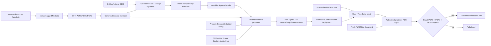

# Nitro EIF Attestation Trust

OpenSecret now separates three questions that the old signed-PCR JSON path mixed
together:

1. **Was this exact release manifest signed with valid, transparency-recorded
   Sigstore evidence?** Sigstore answers this.
2. **May this candidate enter the release channel?** Protected promotion checks
   the release against repository-local builder configuration.
3. **Which promoted releases may a client trust now?** TUF metadata served from
   `https://attestations.trymaple.ai` answers this.

AWS Nitro attestation then answers the live question: **is the enclave I am
connecting to currently presenting the PCR tuple and session key that I
expected?**

No release is activated by merging this code, creating a Git tag, or producing
a Sigstore bundle. Activation is a separate manual, protected TUF promotion.
The production TUF root is deliberately absent until an operator bootstraps it
offline.

## The complete trust chain


```mermaid
flowchart LR
    source["Reviewed source + flake.lock"] --> build["Manual tagged Nix build"]
    build --> eif["EIF + PCR0/PCR1/PCR2"]
    eif --> manifest["Canonical release manifest"]
    oidc["GitHub Actions OIDC"] --> sigstore["Fulcio certificate + Cosign signature"]
    manifest --> sigstore
    sigstore --> rekor["Rekor transparency evidence"]
    rekor --> bundle["Portable Sigstore bundle"]

    bundle --> promotion["Protected manual promotion"]
    manifest --> promotion
    builderConfig["Protected repo-side builder config"] --> promotion
    trustedRoot["TUF-authenticated Sigstore trusted root"] --> promotion
    promotion --> tuf["New signed TUF targets/snapshot/timestamp"]
    tuf --> worker["Atomic Cloudflare Worker deployment"]

    embeddedRoot["SDK-embedded TUF root"] --> client["Rust / TypeScript client"]
    worker --> client
    client --> tuple["Authorized prod/dev PCR tuple"]
    enclave["Fresh AWS Nitro document"] --> tuple
    tuple --> decision{"Exact PCR0 + PCR1 + PCR2 match?"}
    decision -->|yes| key["Trust attested session key"]
    decision -->|no| reject["Fail closed"]
```

The append-only Rekor log makes a signing event durable and auditable. It does
not declare that release current. TUF supplies versioned, expiring, signed
authorization and rollback protection. Cloudflare is only the byte transport:
all clients authenticate the repository bytes through TUF. Rust and browser
TypeScript also perform local cryptographic verification of each portable
Sigstore bundle against the exact TUF-authenticated trusted-root bytes. Signer
identity remains visible for audit, but clients do not use a builder identity
allowlist: TUF authorization of the exact manifest and bundle is the client
release decision.

## Before and after

| Concern | Previous path | New path |
| --- | --- | --- |
| Published statement | A long-lived P-384 key signed PCR0 only | A keyless Sigstore signature covers a canonical manifest containing source revision, locked Nix build data, EIF digest, and PCR0/PCR1/PCR2 |
| Discovery | Client fetched mutable JSON from `raw.githubusercontent.com` | Client starts at `attestations.trymaple.ai/tuf` and follows authenticated TUF metadata |
| Current release | Every valid history entry remained accepted | A monotonic prod/dev channel authorizes at most two active releases |
| Builder identity | Implied by repository history and the custom signing key | Protected promotion checks exact Fulcio/workflow claims against repository-local configuration; clients authorize exact TUF targets, not a builder name |
| Root of trust | Custom PCR public key shipped by old clients | Standard TUF root metadata is pinned by new clients |
| PCR decision | PCR0-only legacy approval | Same-release, same-environment PCR0/PCR1/PCR2 tuple |
| Runtime network | GitHub was in the dependency path | GitHub, Fulcio, and Rekor are not contacted during connection. Both SDKs verify the portable evidence locally from TUF-authenticated bytes |
| Rollout | Updating history immediately enlarged trust | Candidate creation and activation are separate protected actions |

Sigstore does not store values “inside Rekor” as a mutable database lookup.
The PCRs are fields in the exact manifest bytes that Cosign signs. The portable
bundle carries the certificate, signature, and transparency evidence needed to
verify those bytes later. TUF points clients to the exact manifest and bundle
that are currently authorized.

## Release manifest contract

The canonical manifest schema is repository-neutral:

```json
{
  "schema": "https://attestations.trymaple.ai/schemas/nitro-eif-release/v1",
  "component": "opensecret-backend",
  "environment": "prod",
  "release": { "version": "1.2.3" },
  "source": {
    "uri": "https://github.com/OpenSecretCloud/opensecret",
    "path": ".",
    "ref": "refs/tags/v1.2.3",
    "revision": {
      "algorithm": "git-sha1",
      "digest": "0123456789abcdef0123456789abcdef01234567"
    }
  },
  "artifact": {
    "name": "opensecret-v1.2.3-prod.eif",
    "mediaType": "application/vnd.aws.nitro.eif",
    "size": 123456,
    "digests": { "sha256": "..." }
  },
  "measurements": {
    "algorithm": "sha384",
    "requiredPcrs": [0, 1, 2],
    "pcrs": { "0": "...", "1": "...", "2": "..." }
  },
  "build": {
    "system": "nix",
    "builderId": "opensecret-nitro-eif-github-actions",
    "derivation": ".#eif-prod",
    "flakeLockSha256": "...",
    "runUri": "https://github.com/OpenSecretCloud/opensecret/actions/runs/..."
  }
}
```

The current source URI happens to be GitHub because that is where the build runs
today. It is data, not a fixed schema assumption. `builderId` is a bounded
promotion-config selector and audit field; it is not client authorization.
Moving the repository or builder later requires updating protected promotion
tooling/configuration and publishing new release targets, not changing the SDK,
TUF root, or channel schema.

## TUF repository contract

The client base URL is `https://attestations.trymaple.ai/tuf`. The
repository uses standard top-level TUF roles and consistent snapshots:

```text
/tuf/metadata/
  1.root.json
  N.root.json
  N.targets.json
  N.snapshot.json
  timestamp.json
/tuf/targets/
  <sha256>.name                       # hash-prefixed immutable targets
  channels/<sha256>.prod.json
  channels/<sha256>.dev.json
  sigstore/<sha256>.trusted_root.json
  releases/<version>/<env>/<sha256>.manifest.json
  releases/<version>/<env>/<sha256>.manifest.sigstore.json
```

Logical target names appear inside signed TUF metadata. Consistent-snapshot
clients fetch the hash-prefixed HTTP names. Numbered root, targets, and snapshot
metadata and all hash-prefixed targets remain available forever. Only
`timestamp.json` is replaced in place, and it is published last. The protected
state branch additionally retains every signed timestamp envelope as
`timestamp-history/N.timestamp.json`; those internal files are not served, but
the pre-sign continuity check requires live bytes to match the archived
version and then verifies every referenced public byte.

A channel target is deliberately small:

```json
{
  "schema": "https://attestations.trymaple.ai/schemas/channel/v1",
  "environment": "prod",
  "sequence": 12,
  "sigstoreTrustedRootTarget": {
    "path": "sigstore/trusted_root.json",
    "sha256": "..."
  },
  "active": [
    {
      "manifestTarget": "releases/1.2.3/prod/manifest.json",
      "manifestSha256": "...",
      "bundleTarget": "releases/1.2.3/prod/manifest.sigstore.json",
      "bundleSha256": "..."
    }
  ]
}
```

`rollout` retains the previous active release and adds the new one.
`finalize` keeps only the selected release. `revoke` publishes an empty active
set so every new client fails closed if no release is safe. The manager rejects
more than two active entries. Channel JSON has no independent expiry; signed
TUF metadata owns expiration.

## What a new client does

```mermaid
sequenceDiagram
    participant SDK
    participant Site as attestations.trymaple.ai
    participant TUF as Embedded TUF root
    participant Sigstore
    participant Enclave

    SDK->>Site: GET timestamp.json
    SDK->>TUF: Verify signature, version, expiry, rollback
    SDK->>Site: GET numbered snapshot + targets
    SDK->>TUF: Verify hashes, signatures, versions, expiry
    SDK->>Site: GET environment channel
    SDK->>TUF: Verify target length + SHA-256
    SDK->>Site: GET trusted root, active manifests + bundles
    SDK->>TUF: Verify every target
    SDK->>Sigstore: Verify exact manifest bytes, signature, certificate chain, and log evidence offline
    Note over SDK: TUF authorizes exact evidence; signer identity is audit-only in clients
    SDK->>Enclave: Send fresh nonce
    Enclave-->>SDK: AWS-signed document + key + PCR0/1/2
    SDK->>SDK: Require exact tuple from one active release
    SDK->>SDK: Accept key or fail closed
```

The SDK embeds only its initial trusted TUF root, not the latest PCR list. It can
therefore learn newly promoted releases without publishing a new SDK. TUF root
rotation is standard sequential root metadata; a client pinned to version N
downloads and verifies N+1 before trusting it.

The production SDK bootstrap remains root version 1. Every later root is a
numbered online transition (`2.root.json`, `3.root.json`, and so on), and the
attestation repository retains and serves every intermediate version. Do not
replace the SDK's embedded root with a later version merely to shorten that
chain: doing so could hide intermediate online-role authority history from a
new installation. A future embedded-root advance requires a separately
reviewed, authenticated bridge-history design that preserves that history.
The current v1 bootstrap accepts at most 32 sequential rotations (root versions
1 through 33), matching the client update bound; the repository manager refuses
a longer history until that bridge design exists.

Both clients reject redirects, expired metadata, rollback, freeze, unknown
schemas, wrong environment, incomplete tuples, malformed build metadata, and
any target whose length or digest differs. They also reject local Sigstore
signature, certificate-chain, transparency-proof, checkpoint, timestamp, or
trusted-root failures. Neither client rejects an otherwise authorized release
because its observed signer identity differs from an SDK-embedded builder
allowlist; no such allowlist exists.

## Key model

There are two unrelated signing mechanisms:

- **Sigstore release signing is keyless.** The tagged GitHub Actions job obtains
  a short-lived OIDC identity. No Sigstore private key is stored.
- **TUF authorization uses Ed25519 keys.** The initial deployment has one
  threshold-1 offline root key and one threshold-1 online key shared by targets,
  snapshot, and timestamp.

The offline root private key is never a GitHub secret and never enters CI. Store
it outside the repository and use it only for bootstrap and root rotation. The
online private key is the single
`ATTESTATIONS_TUF_ONLINE_PRIVATE_KEY_PEM` secret in the protected
`attestations-production` GitHub Environment. Cloudflare account ID
and an API token scoped to this Worker are the only other production secrets.

This intentionally simple key model can be upgraded later. TUF supports root
updates that add separate online keys or raise role thresholds, and existing
clients verify a new root through the preceding root. The initial manager only
implements bootstrap and ordinary online publication; online-role key rotation
needs a dedicated transition command before operators attempt that upgrade.
Before adding that command or manually publishing rotated roots, the backend
must also reject same-class retired-online key reintroduction (`A -> B -> A`)
and enforce the clients' cumulative 128-fingerprint history bound per
role/class before publication; clients currently fail closed on either
violation.

## Operator setup: deliberately not performed by this change

Production bootstrap fails closed until an operator generates keys and initial
metadata. A safe outline is:

This client contract is being finalized before first publication. Re-bootstrap
any unpublished draft state that contains `policy/builders.json`; never rewrite
already published TUF history to remove a target.

1. Generate root and online Ed25519 keys into an operator-controlled directory,
   never the repository.
2. Download and independently inspect the current official Sigstore trusted
   root.
3. Run the local `bootstrap` command with the offline root key, online key, and
   trusted root.
4. Review `attestations/promotion/builders.json`, which is protected promotion
   input and is never published as a TUF target.
5. Create the protected `attestations-state` branch containing only
   public TUF state. Private keys must not appear there.
6. Put only the online PEM key and scoped Cloudflare credentials in the
   protected GitHub Environment.
7. Configure required reviewers, deployment branch restrictions, tag
   protection, and master protection before the first release.

Example local commands, using paths outside the checkout:

```sh
nix develop --no-update-lock-file
python scripts/manage_tuf_repository.py generate-key --output /secure/offline-root.pem
python scripts/manage_tuf_repository.py generate-key --output /secure/online.pem
curl --fail --proto '=https' --tlsv1.2 \
  https://tuf-repo-cdn.sigstore.dev/targets/trusted_root.json \
  --output /secure/sigstore-trusted_root.json
python scripts/manage_tuf_repository.py bootstrap \
  --repository /secure/attestations-state/tuf \
  --output /secure/rendered/tuf \
  --root-key /secure/offline-root.pem \
  --online-key /secure/online.pem \
  --sigstore-trusted-root /secure/sigstore-trusted_root.json
```

These commands are documentation, not authorization to run them. Review the
generated root and its key IDs before publishing it.

## Release and promotion procedure

### 1. Create an inactive candidate

Dispatch `Nitro EIF Release` on a protected
`vMAJOR.MINOR.PATCH` tag. It:

- rebuilds both dev and prod EIFs from the exact tag with locked Nix inputs;
- requires generated PCR files to match the tagged PCR references;
- generates canonical repository-neutral manifests;
- signs each manifest keylessly and creates portable Sigstore bundles;
- verifies exact workflow/ref/repository/commit/trigger claims; and
- publishes candidate assets.

Candidate publication does **not** update TUF or client trust.

### 2. Promote through the protected environment

Dispatch `Promote Nitro Attestation` from protected master. Select
environment, version, and `rollout` or `finalize`. It:

1. verifies existing TUF state before reading promotion configuration;
2. downloads the inactive candidate;
3. verifies its portable bundle with the TUF-authenticated Sigstore trusted root
   and exact repository-local builder configuration from protected master, then
   rejects evidence outside the narrow bundle/trusted-root profile implemented
   by both SDKs before signing any TUF metadata;
4. proves the live repository is either byte-identical to state or an exact
   authenticated historical subset, rejecting rollback and same-version forks;
5. signs new targets, snapshot, and timestamp metadata with the online key;
6. persists append-only public state without force-pushing;
7. atomically deploys one Worker version containing code and all static bytes;
8. byte-compares every live immutable file; and
9. byte-compares `timestamp.json` last.

`revoke` increments the selected channel sequence with no active releases.
`initial_publish` is a bootstrap escape hatch, accepted only for a `refresh`
when no live timestamp exists and state has never contained a channel or
release. This also makes the first deployment retryable if state persistence
succeeded but Cloudflare deployment failed.

The state branch is persisted before deployment. If Cloudflare deployment
fails, public clients still see the old valid repository while state is one
publication ahead. Repair by rerunning the protected refresh path; do not
rewrite or force-push TUF history.

Timestamp metadata expires after 47 hours. A daily scheduled `refresh` keeps it
inside the clients' 48-hour maximum-validity policy while leaving time for one
retry. Before activation, create an `attestations-refresh` Environment limited
to protected `master`, with the same online-key and Cloudflare secrets but no
required-reviewer wait; scheduled runs select only that Environment and the
workflow itself hard-requires the `refresh` operation. Keep required reviewers
on the separate `attestations-production` Environment used by every manual TUF
rollout, finalize, revoke, and manual refresh. Alert on
workflow failure or a timestamp with less than 24 hours remaining. Targets
expire after 90 days, snapshot after 14 days, and root after one year; plan
offline root renewal well before that deadline.

## Temporary legacy bridge

Existing released clients may still fetch signed PCR history JSON from GitHub.
That bridge remains unchanged:

- `pcr_sign.js` and `pcr_verify.js` retain their original
  PCR0-only format;
- `pcrDevHistory.json` and `pcrProdHistory.json` are not
  rewritten;
- existing `just` recipes remain the manual operator path; and
- the legacy private key is not added to GitHub Actions.

For a release whose PCR tuple changes, the race-free compatibility order is:

1. Run protected TUF `rollout`, which authorizes both the old and new tuples.
2. On the legacy compatibility change, run `just append-pcr-dev` or
   `just append-pcr-prod` with `SIGNING_PRIVATE_KEY`, then run
   `just verify-pcr-history dev` or `prod` with `SIGNING_PUBLIC_KEY`.
3. Review and merge only the corresponding signed history JSON change.
4. Fetch the exact merged raw URL, compare it byte-for-byte with the merged
   file, and rerun the signature verifier against those bytes. Do not deploy on
   a GitHub UI preview or an unmerged branch.
5. Deploy the enclave and verify it reports the intended PCR tuple.
6. Run protected TUF `finalize` only after deployment verification.

For production, step 4 is concretely:

```sh
temporary_history="$(mktemp)"
trap 'rm -f "$temporary_history"' EXIT
curl --fail --silent --show-error --max-redirs 0 --proto '=https' --tlsv1.2 \
  https://raw.githubusercontent.com/OpenSecretCloud/opensecret/master/pcrProdHistory.json \
  --output "$temporary_history"
cmp -- "$temporary_history" pcrProdHistory.json
SIGNING_PUBLIC_KEY="$SIGNING_PUBLIC_KEY" just verify-pcr-history prod
```

Use `pcrDevHistory.json` and `dev` for development. The `cmp` proves the local
bytes verified by the unchanged legacy verifier are exactly the merged raw
bytes.

If `rollout` reports that the complete PCR0/PCR1/PCR2 tuple is already active,
do not create a redundant overlap; use `finalize` as directed. New clients
never read or fall back to the legacy JSON. Once old versions no longer need
support, the bridge and GitHub raw-file dependency can be removed without
changing the TUF/Sigstore protocol.

Builder configuration is ordinary protected promotion tooling: changing it can
admit a different builder to a future promotion, but it does not change old
client code or publish a client policy. The initial publisher deliberately has
no Sigstore trusted-root update command; replacing that TUF target requires a
separately reviewed transition operation. Inactive logical release targets are
pruned automatically; their
consistent-snapshot hash-prefixed bytes and historical metadata remain
append-only.

## Security boundaries

- Sigstore proves attributable, transparency-recorded provenance; it does not
  prove code safety or current approval. Both SDKs re-verify it locally, while
  TUF authorizes the exact evidence without consulting a client builder
  allowlist.
- Promotion's Cosign check is the cryptographic and builder-authorization gate.
  The publisher's additional strict schema check is a compatibility gate: it
  prevents activating cryptographically valid evidence that either SDK cannot
  parse or verify.
- TUF authorizes current releases and resists rollback/freeze; it does not prove
  the enclave is running.
- AWS Nitro attestation proves a fresh document and binds its key/PCRs; it does
  not decide whether that tuple is approved.
- Nix makes independent reproduction practical; one builder's manifest is not
  itself independent reproduction.
- Cloudflare availability and TLS are operational defenses. TUF authentication
  remains the byte-integrity defense for every client; local Sigstore
  verification adds a separate cryptographic provenance check in both SDKs. It
  is not an independent release authority in this initial model because Maple's
  TUF authority also authenticates the Sigstore trusted-root target.
- A GitHub or builder migration updates protected promotion configuration and
  the next manifest's source/audit fields, not client code or the TUF root.
