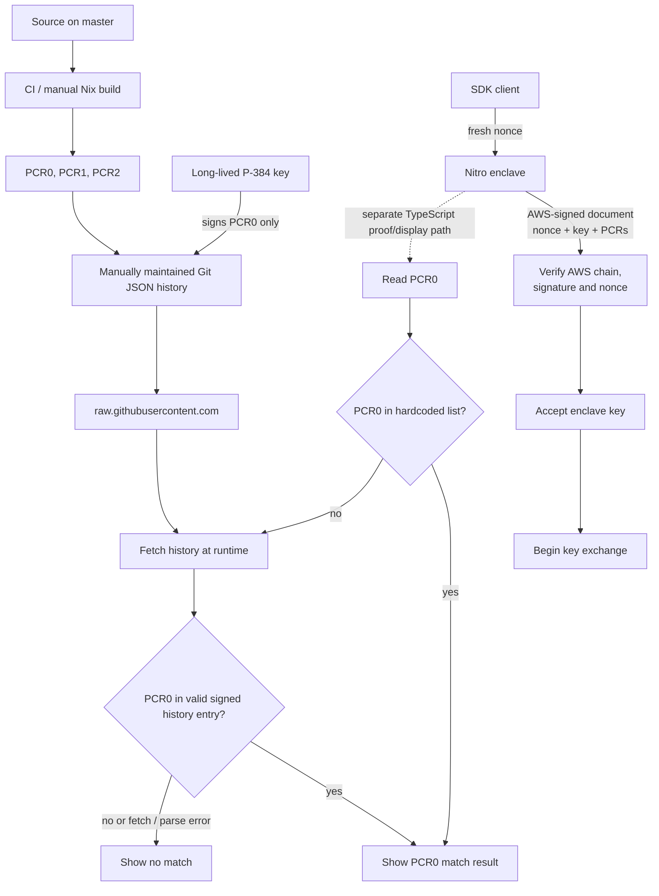
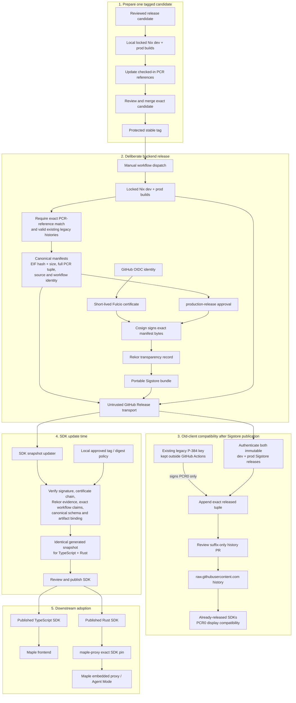
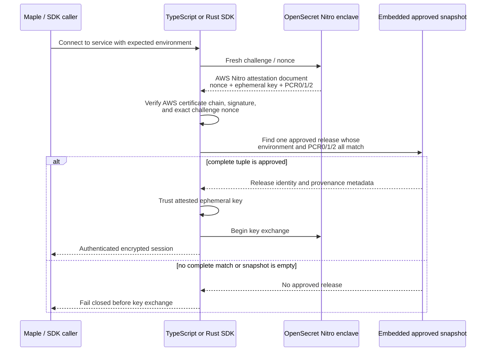
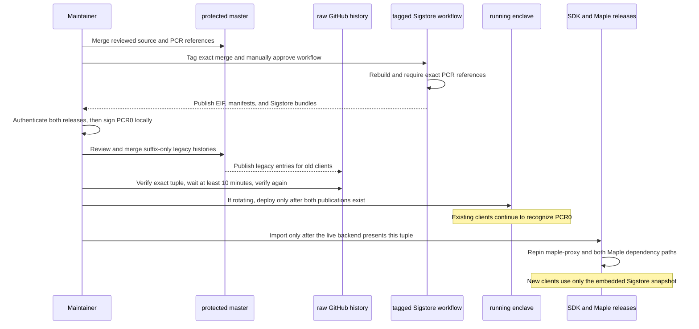

# Nitro EIF Release Verification

OpenSecret publishes AWS Nitro EIF measurements at deliberate, manually approved
release boundaries. Each release contains deterministic manifests signed
keylessly by the tagged GitHub Actions workflow and recorded in Sigstore's
transparency infrastructure.

Sigstore is the provenance and transparency layer. It is not the artifact
transport, a software-safety oracle, a reproducibility proof, a revocation
service, or a source of truth for the newest approved release.

## The Short Version

The old release metadata could answer, "Does this enclave's PCR0 appear in a
hardcoded list or a JSON history fetched from GitHub?" More importantly, that
PCR0 check did not gate the normal TypeScript key exchange, and the normal Rust
client supplied no expected-PCR policy. The new design makes release
authorization part of the security gate and asks a stronger, compound
question:

> Did the expected, manually approved, tag-only OpenSecret release workflow
> sign this exact canonical manifest; was that signature publicly witnessed;
> does the manifest bind the tagged source to this exact EIF and complete
> PCR0/PCR1/PCR2 tuple; is this release locally approved for the requested
> environment; and does a fresh Nitro attestation present that same tuple
> before its session key is trusted?

Sigstore does not store the EIF or act as a package registry. GitHub Releases
still transports the EIF, manifest, and verification bundle. Those downloads
are treated as untrusted bytes. Sigstore makes the manifest independently
verifiable by binding its exact bytes to a short-lived GitHub Actions identity
and an append-only transparency-log record.

The SDKs do not contact GitHub, Fulcio, or Rekor during an application
handshake. A maintainer runs the SDK snapshot updater at release/update time;
it verifies the downloaded Sigstore evidence and embeds the resulting approved
release records into TypeScript and Rust. Runtime verification is therefore
offline, deterministic, and unavailable network services cannot cause a
fallback to weaker trust data.

During the migration window the backend deliberately publishes each new
measurement tuple through **both** trust paths:

- already-released clients continue to read the PCR0-only signed histories from
  `raw.githubusercontent.com`; and
- new clients trust only the full Sigstore-verified release snapshot.

This is dual publication, not a runtime fallback. A new client never accepts
the weaker legacy record when Sigstore verification fails. In the previously
released TypeScript SDK, the GitHub history lookup fed attestation
display/reporting rather than key-exchange authorization; preserving it still
avoids a compatibility and operational-observability cliff for those clients.

## Before and After

| Concern | Before | Target, with temporary migration bridge | Security effect |
| --- | --- | --- | --- |
| Release boundary | Ordinary builds ran on `master` pushes, pull requests, and manual runs; trusted history changed through a manual Git update | An existing stable `vMAJOR.MINOR.PATCH` tag, manually dispatched through the `production-release` environment; only after its immutable Sigstore Release exists is the exact tuple added to the legacy history | Production trust changes become deliberate review events without breaking old clients or pre-authorizing abandoned candidates |
| Signer | One long-lived custom P-384 private key | Primary: a short-lived keyless certificate issued for the exact tagged GitHub Actions workflow through GitHub OIDC and Fulcio. Bridge only: the existing P-384 key signs PCR0 locally for old clients | The new trust path has no long-lived repository signing key; the old key remains narrowly contained until compatibility ends |
| Signed statement | Only the PCR0 string | Primary: exact canonical manifest bytes binding source tag and commit, repository IDs, environment, build derivation, EIF SHA-256 and size, PCR0/PCR1/PCR2, and workflow run attempt. Bridge: unchanged PCR0-only format | New clients cannot transplant a valid signature to another artifact, environment, tuple, or build |
| Public audit trail | Mutable Git history | Primary: Sigstore bundle with Rekor transparency evidence. Bridge: append-only-in-CI Git JSON for old clients | New signing events are independently witnessed and tamper-evident; the legacy path is preserved but not promoted |
| Client input | Hardcoded PCR0 lists were checked first; an unmatched PCR0 caused a runtime download of mutable `raw.githubusercontent.com` history | New SDKs use a reviewed, Sigstore-verified snapshot embedded identically in TypeScript and Rust; old SDKs temporarily keep their existing GitHub lookup | New runtime trust has no GitHub dependency and errors fail closed, while deployed old clients remain compatible |
| Enclave policy | TypeScript checked PCR0 later in its display path; the normal Rust client supplied no expected PCR map | Atomic same-release PCR0/PCR1/PCR2 match for an explicitly selected environment in both languages | Measurement authorization becomes mandatory rather than informational |
| Origin binding | Environment could be inferred by trying both lists | Known service origins map to exactly one environment; unknown remote origins require an explicit choice | A development measurement cannot satisfy a production connection |
| Key acceptance | A valid AWS Nitro document and nonce were enough for the normal handshake to accept the attested key | Nitro document, nonce, environment, full tuple, and approved release are checked before accepting the enclave key or starting key exchange | A genuine but unapproved Nitro enclave cannot receive secrets |
| Reproducibility | Nix build existed but was not bound to a signed release statement | Locked Nix inputs and derivation metadata are bound into the manifest; independent rebuilding remains a separate check | Provenance and reproducibility evidence can be compared without conflating them |
| Rollback | Old entries remained usable | Old signed entries also remain cryptographically valid; the embedded approved snapshot supplies the current local policy | Sigstore improves history integrity but does not itself solve rollback or revocation |

### Previous Flow


```mermaid
flowchart TB
    source["Source on master"] --> build["CI / manual Nix build"]
    build --> pcrs["PCR0, PCR1, PCR2"]
    pcrs --> history["Manually maintained Git JSON history"]
    legacyKey["Long-lived P-384 key"] -->|"signs PCR0 only"| history
    history --> raw["raw.githubusercontent.com"]

    client["SDK client"] -->|"fresh nonce"| enclave["Nitro enclave"]
    enclave -->|"AWS-signed document<br/>nonce + key + PCRs"| aws["Verify AWS chain,<br/>signature and nonce"]
    aws --> key["Accept enclave key"]
    key --> exchange["Begin key exchange"]

    enclave -.->|separate TypeScript proof/display path| view["Read PCR0"]
    raw --> runtime["Fetch history at runtime"]
    view --> local{"PCR0 in hardcoded list?"}
    local -->|yes| badge["Show PCR0 match result"]
    local -->|no| runtime
    runtime --> remote{"PCR0 in valid signed history entry?"}
    remote -->|yes| badge
    remote -->|"no or fetch / parse error"| noMatch["Show no match"]
```

PCR1, PCR2, the source commit, build identity, and actual EIF digest were not
covered by the legacy signature. Git authenticated changes only as ordinary
repository history; it did not provide a separately witnessed append-only
signing record. The diagram's dashed path is the most consequential old
boundary: TypeScript displayed a PCR0 result after the key had already been
accepted, while the normal Rust path did not install a PCR allowlist.

### New Release, Compatibility, and Distribution Flow


```mermaid
flowchart TB
    subgraph prepare["1. Prepare one tagged candidate"]
        candidate["Reviewed release candidate"] --> localNix["Local locked Nix dev + prod builds"]
        localNix --> refs["Update checked-in PCR references"]
        refs --> merge["Review and merge exact candidate"]
        merge --> tag["Protected stable tag"]
    end

    subgraph release["2. Deliberate backend release"]
        tag --> dispatch["Manual workflow dispatch"]
        dispatch --> nix["Locked Nix dev + prod builds"]
        nix --> equality["Require exact PCR-reference match<br/>and valid existing legacy histories"]
        equality --> manifest["Canonical manifests<br/>EIF hash + size, full PCR tuple,<br/>source and workflow identity"]
        manifest --> approval["production-release approval"]
        oidc["GitHub OIDC identity"] --> fulcio["Short-lived Fulcio certificate"]
        fulcio --> sign["Cosign signs exact manifest bytes"]
        approval --> sign
        sign --> rekor["Rekor transparency record"]
        rekor --> bundle["Portable Sigstore bundle"]
        manifest --> publish["Untrusted GitHub Release transport"]
        bundle --> publish
        nix --> publish
    end

    subgraph bridge["3. Old-client compatibility after Sigstore publication"]
        publish --> authenticate["Authenticate both immutable<br/>dev + prod Sigstore releases"]
        oldKey["Existing legacy P-384 key<br/>kept outside GitHub Actions"] -->|"signs PCR0 only"| append["Append exact released tuple"]
        authenticate --> append
        append --> bridgeMerge["Review suffix-only history PR"]
        bridgeMerge --> raw["raw.githubusercontent.com history"]
        raw --> oldClients["Already-released SDKs<br/>PCR0 display compatibility"]
    end

    subgraph update["4. SDK update time"]
        publish --> updater["SDK snapshot updater"]
        updater --> verify["Verify signature, certificate chain,<br/>Rekor evidence, exact workflow claims,<br/>canonical schema and artifact binding"]
        policy["Local approved tag / digest policy"] --> verify
        verify --> snapshot["Identical generated snapshot<br/>for TypeScript + Rust"]
        snapshot --> review["Review and publish SDK"]
    end

    subgraph downstream["5. Downstream adoption"]
        review --> ts["Published TypeScript SDK"]
        ts --> mapleFrontend["Maple frontend"]
        review --> rust["Published Rust SDK"]
        rust --> proxy["maple-proxy exact SDK pin"]
        proxy --> mapleAgent["Maple embedded proxy / Agent Mode"]
    end
```

The signing job can obtain an OIDC identity but cannot write a GitHub Release.
The separate publishing job can write the Release but cannot obtain an OIDC
identity. It re-verifies the candidate before publication. This separation
reduces the authority held by either job.

The release workflow never receives the legacy private key. It publishes the
immutable Sigstore evidence first. On the exact released tag,
`append-legacy-pcr-release` independently rebuilds and authenticates both dev
and prod outputs, then—and only then—uses the existing local key to append or
reuse the matching legacy entries.

### New Runtime Handshake


```mermaid
sequenceDiagram
    participant App as Maple / SDK caller
    participant SDK as TypeScript or Rust SDK
    participant Enclave as OpenSecret Nitro enclave
    participant Snapshot as Embedded approved snapshot

    App->>SDK: Connect to service with expected environment
    SDK->>Enclave: Fresh challenge / nonce
    Enclave-->>SDK: AWS Nitro attestation document<br/>nonce + ephemeral key + PCR0/1/2
    SDK->>SDK: Verify AWS certificate chain, signature,<br/>and exact challenge nonce
    SDK->>Snapshot: Find one approved release whose<br/>environment and PCR0/1/2 all match
    alt complete tuple is approved
        Snapshot-->>SDK: Release identity and provenance metadata
        SDK->>SDK: Trust attested ephemeral key
        SDK->>Enclave: Begin key exchange
        SDK-->>App: Authenticated encrypted session
    else no complete match or snapshot is empty
        Snapshot-->>SDK: No approved release
        SDK-->>App: Fail closed before key exchange
    end
```

This creates two distinct verification moments:

1. **Update time:** verify who released the software and which exact artifact
   and measurements they released.
2. **Connection time:** verify which software measurement is running now and
   that the presented session key belongs to that fresh attestation.

Neither moment substitutes for the other.

Runtime validates the embedded snapshot's strict schema and self-consistency
hash, but it does not re-run Sigstore verification. The `snapshotId` is not a
second signature. Snapshot authenticity comes from reviewing the updater's
Sigstore-verified output and then trusting the SDK/package/application
distribution channel that delivers those embedded bytes.

There is one deliberate local-development exception. TypeScript permits its
local path only for exact HTTP loopback origins. Rust mock attestation requires
a compile-time feature, and `maple-proxy` exposes it only through the explicitly
named `insecure-local-mock-attestation` feature used by `just run-local`.
Ordinary, default, and release builds do not enable it. Selecting the `dev`
environment for a remote service is not an attestation bypass.

## Trust Layers

The complete trust decision has separate layers:

1. **AWS Nitro attestation** authenticates a fresh NSM document and binds its
   PCRs, caller nonce, and ephemeral session public key.
2. **OpenSecret release policy** decides which tagged manifest is approved for
   the expected `dev` or `prod` environment.
3. **Sigstore verification** proves the exact manifest bytes were signed by the
   authorized OpenSecret release workflow and included in the transparency log.
4. **Artifact verification** checks that the released EIF has the SHA-256 and
   size recorded in the verified manifest.
5. **Reproducibility** is established separately by rebuilding the same tagged,
   locked source and comparing the EIF digest and PCR tuple.
6. **Rollback and revocation policy** decides whether an older, correctly signed
   release remains acceptable.

All six concerns matter. A valid Sigstore bundle for an old release remains
cryptographically valid after that release is withdrawn.

## What Sigstore Proves

For this design, full consumer/update verification proves that:

- the exact canonical manifest bytes were signed;
- Fulcio issued the signing certificate to GitHub's OIDC identity for the exact
  OpenSecret repository, workflow, tagged ref, commit, trigger, required
  environment name, hosted runner, and run attempt required by local policy;
- the signing event has valid Sigstore transparency evidence; and
- the manifest itself binds the source/build identity to an EIF digest and one
  complete, environment-specific PCR tuple.

Cosign directly enforces the workflow name, repository, tag ref, source commit,
trigger, signer identity, and issuer. The SDK updater additionally validates
the generic Fulcio certificate extensions for the GitHub-hosted runner,
`production-release` environment, environment subject, and exact workflow-run
attempt URI. GitHub Environment reviewer settings themselves remain external
repository-admin controls and are not described by those certificate strings.

More precisely, a portable bundle proves inclusion in a signed Rekor
checkpoint. The stronger ecosystem guarantee that all observers see one
consistent append-only history depends on transparency-log monitoring and
witnessing. The bundle is independently verifiable evidence; it is not a
reason to stop monitoring the log.

It does **not** prove that:

- the source code is safe, the workflow is bug-free, or GitHub's builder was
  uncompromised;
- a Nix expression is reproducible or an independent party reproduced it;
- the signed release is the newest release or still approved; or
- GitHub Releases will remain available.

Those properties require source review and CI hardening, independent rebuilds,
an explicit approved-snapshot policy, and artifact mirroring or availability
planning respectively.

## Failure and Attack Scenarios

| Scenario | Result |
| --- | --- |
| A release asset or manifest is modified in transit or on GitHub | The manifest signature, EIF digest/size, or checksums fail |
| A different repository, branch, workflow, runner type, or differently named environment signs a valid bundle | Exact Fulcio identity and extension policy rejects it |
| Required reviewers or deployment restrictions are removed from the same-named `production-release` environment | Fulcio cannot detect this; environment protections are separate repository-admin controls that must be configured and audited |
| A development EIF is presented by the production service | Origin-to-environment binding and the environment-specific full tuple reject it |
| PCR0 comes from one approved release while PCR1/PCR2 come from another | Atomic same-release tuple matching rejects it |
| Rekor or GitHub is unavailable during an application handshake | No effect; runtime uses the already reviewed embedded snapshot |
| No signed release has populated the SDK snapshot | Remote attestation fails closed before key exchange |
| A released candidate lacks a valid matching legacy entry | Sigstore publication can succeed, but the authenticated compatibility wrapper or deployment gate fails; the running enclave is not replaced until raw GitHub exposes an append-only matching tuple |
| A pull request truncates, reorders, or edits an existing legacy entry | The append-only transition check fails, including changes to PCR1, PCR2, or timestamps that the old PCR0-only signature did not cover |
| A valid dev entry is copied into prod, or vice versa | Cross-history PCR0 separation rejects it; this compensates for the legacy signature having no environment field |
| The existing legacy private key is lost | No replacement key can restore compatibility because old clients pin the original public key; do not rotate it or put it in Actions |
| An attacker replays an older release that was once valid | Sigstore alone does not reject it; the shipped approved snapshot, and later a stronger minimum-version or TUF policy, must do so |
| The authorized release workflow or its reviewed source is malicious before signing | Sigstore preserves attributable evidence but cannot declare the software safe; repository controls, review, and independent reproduction remain necessary |
| A user installs an older SDK containing an older approved snapshot | This remains a downstream rollback problem; distribution/version policy must prevent SDK downgrade |

## Activation and Rollout

Merging this code does not silently trust an unreleased build. Until the first
approved tag is signed and deliberately imported, the generated SDK snapshot
contains no releases and real remote handshakes fail closed.


```mermaid
sequenceDiagram
    participant Maintainer
    participant Master as protected master
    participant Raw as raw GitHub history
    participant Release as tagged Sigstore workflow
    participant Backend as running enclave
    participant SDK as SDK and Maple releases

    Maintainer->>Master: Merge reviewed source and PCR references
    Maintainer->>Release: Tag exact merge and manually approve workflow
    Release->>Release: Rebuild and require exact PCR references
    Release-->>Maintainer: Publish EIF, manifests, and Sigstore bundles
    Maintainer->>Maintainer: Authenticate both releases, then sign PCR0 locally
    Maintainer->>Master: Review and merge suffix-only legacy histories
    Master-->>Raw: Publish legacy entries for old clients
    Maintainer->>Raw: Verify exact tuple, wait at least 10 minutes, verify again
    Maintainer->>Backend: If rotating, deploy only after both publications exist
    Note over Backend: Existing clients continue to recognize PCR0
    Maintainer->>SDK: Import only after the live backend presents this tuple
    SDK->>SDK: Repin maple-proxy and both Maple dependency paths
    Note over SDK: New clients use only the embedded Sigstore snapshot
```

Both Maple dependency paths must advance:

- the frontend consumes the TypeScript SDK; and
- Agent Mode consumes the Rust SDK through the embedded `maple-proxy`.

Updating only one path would leave the other on the previous trust behavior.
The consumer pull requests therefore remain staging changes until a real
signed release populates the snapshot and the corresponding packages and
commit pins exist.

For the first rollout, publish Sigstore evidence for the backend release that
is **already deployed**. Confirm that its fresh live Nitro attestation presents
the exact released PCR0/PCR1/PCR2 tuple, then import that release into the SDK
snapshot and publish the new clients. If the live tuple already matches, no
enclave replacement is needed merely to activate the new client policy.

For later rotations:

1. publish the tagged Sigstore release first;
2. append its exact authenticated tuple to the legacy history for old clients;
3. merge and soak that raw publication before changing the enclave;
4. deploy and verify the new live tuple; and
5. publish new SDK/Maple versions only with a snapshot that authorizes the
   backend tuple those clients will actually encounter.

Merging a signed legacy suffix is an irreversible approval for legacy clients,
but it now occurs only after the immutable Sigstore release exists.
Once `raw.githubusercontent.com` exposes it, the append-only policy forbids
deleting or rewriting it. A locally prepared, unmerged entry may be discarded;
an abandoned merged candidate must remain in history, and its replacement
needs a new commit and a new semver tag.

Do not publish or promote the new SDK code with an empty snapshot. On later
rollouts, a replacement SDK snapshot should retain the currently running tuple
while adding the next tuple so updated clients work on both sides of the
cutover. That does **not** help Sigstore-only clients still running the previous
static snapshot: they cannot authorize a future tuple they have never received.

There is therefore no universal zero-downtime rotation for arbitrarily old
static-snapshot clients. Before each later backend cutover, choose and document
one of these product policies:

- require adoption of a minimum SDK/Maple version that contains the next tuple;
- keep old and new enclave endpoints available during a bounded blue/green
  compatibility period; or
- first ship an authenticated dynamic release-policy mechanism, such as the
  proposed OpenSecret TUF layer.

Do not retire the legacy bridge or represent later rotations as seamless until
one of those policies is implemented and enforced.

## Manual Tagged Release

The release workflow is
`.github/workflows/release-nitro-eif.yml` (`Nitro EIF Release`).

Before using it, repository administrators must configure controls that cannot
be expressed in this repository:

- Protect the `production-release` GitHub Environment with required reviewers,
  prevent self-review, and restrict deployment refs to stable `v*` tags.
- Protect `v*` tags against unauthorized creation, update, and deletion.
- Add CODEOWNERS coverage for the release/build workflows, manifest and legacy
  verification tooling, PCR references, and histories, then require that
  review. The repository does not currently contain a CODEOWNERS file, so the
  actual owner team must be selected before the first release.
- Enable immutable GitHub Releases.

Do not perform a first dispatch until `production-release` already exists with
those protections. Merely referencing a missing environment from a workflow
can create it without the required reviewer and deployment-branch rules. The
workflow also fails unless the selected tag reports `github.ref_protected`.

To publish during the compatibility window:

1. On the exact intended release candidate, update both checked-in PCR
   references:

   ```sh
   just prepare-pcr-references
   ```

2. Review and merge the intended source and PCR references to protected
   `master`; do **not** add a new legacy entry yet. CI proves the locked Nix
   builds equal those references while independently validating the existing
   histories.
3. Create a tag on that exact merged commit whose name matches exactly
   `vMAJOR.MINOR.PATCH`. Prerelease suffixes and leading zeroes are
   intentionally rejected.
4. Dispatch the workflow with that tag as its workflow ref:

   ```sh
   gh workflow run release-nitro-eif.yml \
     --repo OpenSecretCloud/opensecret \
     --ref vMAJOR.MINOR.PATCH
   ```

5. Approve the `production-release` deployment after reviewing the selected tag
   and commit.
6. Wait for the immutable GitHub Release to publish. On a branch created from
   the exact released tag, recover the **existing** `SIGNING_PRIVATE_KEY` as a
   base64-encoded PKCS#8 DER key in a trusted local operator environment and
   run:

   ```sh
   git switch -c legacy-compat-vMAJOR.MINOR.PATCH vMAJOR.MINOR.PATCH
   nix develop
   just update-pcr-all vMAJOR.MINOR.PATCH
   ```

   The wrapper rebuilds dev and prod, authenticates both immutable Sigstore
   releases, and only then appends or reuses the exact tuples. It rejects a
   replacement key, mixed tuple, invalid history, unrelated tracked change, or
   non-suffix retry. The legacy key never enters GitHub Actions.
7. Commit only `pcrDevHistory.json` and `pcrProdHistory.json`, review the
   suffix-only changes, and merge them to protected `master`. CI requires at
   most one new final entry per environment, requires the PCR references to
   predate and remain unchanged by this compatibility PR, and binds each new
   final tuple to its reference.

   The legacy JSON format has no release-tag field, so CI cannot itself prove
   that Sigstore publication preceded the local signature. The authenticated
   wrapper plus required operator/code-owner review is the enforcement boundary;
   the low-level `append-pcr-*` recipes must not be used as release entrypoints.
8. Require two exact
   reads of the raw `master` history separated by at least ten minutes:

   ```sh
   just verify-legacy-pcr-propagated dev pcrDev.json
   just verify-legacy-pcr-propagated prod pcrProd.json
   # Wait at least 600 seconds, then run both commands again.
   ```

   The raw endpoint currently advertises `Cache-Control: max-age=300`. The
   first successful read records a local marker; the second succeeds only
   after 600 seconds and fetches the exact tuple again. This conservative soak
   reduces stale-edge risk but cannot prove that every CDN point of presence
   has refreshed.
9. Check out the exact clean protected tag, enter the pinned Nix development
   shell, and only then deploy:

   ```sh
   git checkout vMAJOR.MINOR.PATCH
   nix develop
   just deploy-dev-nix vMAJOR.MINOR.PATCH
   just deploy-prod-nix vMAJOR.MINOR.PATCH
   ```

   Each recipe first stages the content-addressed EIF, then downloads the
   published manifest and bundle, verifies the
   expected Fulcio/Cosign identity, requires GitHub's live protected tag to
   resolve to the local commit and the Release to be immutable, binds the
   manifest to the exact local EIF digest and complete tuple, and repeats the
   two-read raw-history gate. It uploads
   `opensecret-${tag}-${environment}-${sha256}.eif`. It then holds one host-wide
   remote lock while it verifies the digest, terminates every exact-name
   `opensecret` enclave, re-verifies the digest, launches that same file, and
   restarts the proxy. The operator confirmation happens before the live
   publication checks. Split `stage`/`run-stage` and low-level `run-eif-*`
   commands are not safe release entrypoints.

   The remote `flock` serializes callers of the gated recipe on one parent
   instance; an operator issuing direct `nitro-cli` commands can bypass it.

   A launch or SSH failure after termination does not automatically restore the
   previous enclave. Retry the same protected tag for a transient failure. To
   roll back, check out a previously approved protected tag and run its normal
   `deploy-dev-nix` or `deploy-prod-nix` recipe; the old tag must pass the same
   legacy-publication, Sigstore, remote-tag, artifact, and digest gates. No
   authenticated prior-tag rollback exists until at least two protected
   Sigstore releases have completed this process.

For the bootstrap release that describes an already-running backend, step 9 is
optional only after a fresh live attestation is independently shown to equal
the released complete tuple. Import and publish the first snapshot-bearing SDK
only after that live equality check.

Dispatching the workflow from `master` and supplying a tag as free-form text is
not supported. The selected workflow ref must itself be the tag so the Fulcio
certificate binds the signature to `refs/tags/vMAJOR.MINOR.PATCH`.

If a run must be retried, use **Re-run all jobs**. The manifests and artifact
names deliberately bind the run attempt, so **Re-run failed jobs** cannot reuse
successful outputs from an earlier attempt. Publication fails closed if any
Release for the tag already exists, whether draft or published, and never
deletes or replaces it. Inspect an unpublished draft manually. Only after
confirming it is stale or incomplete and that the protected remote tag still
identifies the intended commit should an operator explicitly delete the draft
and rerun all jobs. Never alter a published Release. If source or deterministic
build outputs must change, create a new commit and new semver tag.

The workflow:

1. Validates the repository identity, owner identity, tag syntax, tag object,
   checked-out commit, and master ancestry. Immediately before draft creation
   and again before publication, it also resolves the live remote tag and
   requires it to equal the dispatched commit.
2. Builds `eif-dev` and `eif-prod` from the exact tagged source on the ARM64 Nix
   runner, requires each output to equal its checked-in PCR reference, and
   verifies the existing legacy histories without requiring the new tuple.
3. Generates and independently revalidates one strict manifest per environment.
4. Uses Cosign 3.1.2 keyless signing to create a Sigstore v0.3 message-signature
   bundle over each manifest's exact bytes.
5. Creates SHA-256 checksums for the runtime assets.
6. Generates an additional GitHub SLSA/DSSE audit bundle covering both EIFs,
   both manifests, and the checksum file.
7. Transfers the signed release candidate to a separate publication job.
8. The publication job has no OIDC permission. It revalidates the manifests,
   independently verifies both Cosign bundles, checks every checksum and SLSA
   subject, attaches the explicit public assets to one draft GitHub Release,
   and only then publishes it.

OIDC signing permission exists only in the `production-release`-gated signing
job, which has no GitHub Release write permission. The publication job has
GitHub Release write permission but no OIDC permission. Ordinary pull-request
and master builds cannot mint release signatures.

## Release Assets

For tag `v1.2.3`, the published assets are:

```text
opensecret-v1.2.3-dev.eif
opensecret-nitro-v1.2.3-dev.manifest.json
opensecret-nitro-v1.2.3-dev.manifest.sigstore.json
opensecret-v1.2.3-prod.eif
opensecret-nitro-v1.2.3-prod.manifest.json
opensecret-nitro-v1.2.3-prod.manifest.sigstore.json
opensecret-nitro-v1.2.3.sha256
opensecret-nitro-v1.2.3.slsa.sigstore.json
```

GitHub Releases are an untrusted byte transport. Consumers authenticate a
manifest with its adjacent `manifest.sigstore.json` bundle before parsing or
using any manifest field.

The Cosign message-signature bundle is the cross-language runtime/update
contract. The SLSA/DSSE bundle is additional audit provenance and is not a
substitute for the simpler message-signature verification path.

## Manifest Contract

The schema identifier is:

```text
https://opensecret.cloud/attestations/nitro-eif-release/v1
```

The generator emits sorted, two-space-indented UTF-8 JSON followed by exactly
one line feed. It rejects duplicate keys, unknown fields, missing fields,
noncanonical tags and commits, malformed hashes, missing PCRs, and all-zero PCR
measurements. No wall-clock timestamp or mutable download URL is included.

A representative production manifest is:

```json
{
  "artifact": {
    "mediaType": "application/vnd.aws.nitro.eif",
    "name": "opensecret-v1.2.3-prod.eif",
    "sha256": "<64 lowercase hexadecimal characters>",
    "size": 123456789
  },
  "build": {
    "derivation": "eif-prod",
    "flakeLockSha256": "<64 lowercase hexadecimal characters>",
    "system": "nix",
    "workflowRun": "https://github.com/OpenSecretCloud/opensecret/actions/runs/123456789/attempts/1"
  },
  "environment": "prod",
  "measurements": {
    "algorithm": "sha384",
    "pcrs": {
      "0": "<96 lowercase hexadecimal characters>",
      "1": "<96 lowercase hexadecimal characters>",
      "2": "<96 lowercase hexadecimal characters>"
    },
    "requiredPcrs": [
      0,
      1,
      2
    ]
  },
  "release": {
    "tag": "v1.2.3"
  },
  "schema": "https://opensecret.cloud/attestations/nitro-eif-release/v1",
  "source": {
    "commit": "<40 lowercase hexadecimal characters>",
    "ownerId": 185423582,
    "ref": "refs/tags/v1.2.3",
    "repository": "OpenSecretCloud/opensecret",
    "repositoryId": 921901924
  }
}
```

PCR0 is not the raw EIF SHA-256. The manifest records both values and the full
PCR0/PCR1/PCR2 tuple.

## Consumer Verification Policy

A relying SDK or update tool must:

1. Obtain the manifest and message-signature bundle as untrusted bytes.
2. Require Sigstore bundle media type
   `application/vnd.dev.sigstore.bundle.v0.3+json`.
3. Load the Sigstore trust root independently rather than trusting roots
   supplied by the release transport.
4. Verify the Fulcio chain, transparency evidence, timestamp evidence, and the
   message signature over the exact manifest bytes.
5. Require issuer exactly `https://token.actions.githubusercontent.com`.
6. Require the signer identity to match exactly:

   ```text
   https://github.com/OpenSecretCloud/opensecret/.github/workflows/release-nitro-eif.yml@refs/tags/vMAJOR.MINOR.PATCH
   ```

7. Require the Fulcio extensions for the exact workflow name, repository,
   tag ref, source commit, `workflow_dispatch` trigger, GitHub-hosted runner,
   `production-release` environment, and run-invocation URI. The run-invocation
   URI must equal the manifest's immutable `build.workflowRun` attempt URL.
8. Strictly parse the already verified bytes and enforce repository ID
   `921901924`, owner ID `185423582`, source repository, tag/ref/commit,
   environment, schema, build derivation, and digest formats.
9. Apply a local approved-release or pinned-manifest policy. A Rekor inclusion
   proof does not mean "current" or "approved."
10. Verify a fresh AWS Nitro document and compare its full PCR0/PCR1/PCR2 tuple
   with the environment-specific manifest.
11. Only after every check succeeds, trust the attested ephemeral key and begin
    `/key_exchange`.

Production must never fall back to accepting a `dev` manifest. Verification
errors and missing evidence fail closed. A previously verified, pinned bundle
may be cached by digest so normal attestation does not require an online Rekor
lookup.

## Reproducibility

The tagged build uses the locked Nix flake, Cargo lockfile, pinned submodules,
and environment-specific EIF derivations. This is good reproducibility
groundwork, but the release signature still represents a builder claim.

Independent reproduction requires another trusted builder to check out the same
tag and locked inputs, run:

```sh
nix build '.?submodules=1#eif-dev'
nix build '.?submodules=1#eif-prod'
```

and compare the raw EIF SHA-256 plus PCR0/PCR1/PCR2 with the release manifest.
Two builds on the same runner are repeatability evidence, not independent
reproduction.

## Rollback and Revocation

Transparency logs retain old, valid records. They intentionally do not delete a
release when OpenSecret stops approving it.

Phase one consumers must ship or otherwise authenticate an explicit set of
approved manifest digests/tags. Moving to a different approved release is a new
SDK/update-policy decision. If dynamically updated authorization is needed
later, use a separate OpenSecret TUF repository; Sigstore's own TUF repository
distributes Sigstore trust roots, not OpenSecret release policy.

Never use a signed mutable `latest.json` as the sole current-release mechanism:
an attacker can replay an older correctly signed copy.

Operational rollback uses the same authenticated deployment path as forward
deployment. For a transient launch failure, rerun the same tag. For a rollback,
check out a prior approved tag, enter its pinned Nix shell, and run
`just deploy-dev-nix vOLD` or `just deploy-prod-nix vOLD`. There is no automatic
rollback, and a prior tag is deployable only while it still satisfies every
legacy-publication, immutable-Release, live-tag, Sigstore, and digest check.

## Transitional Legacy PCR Compatibility

`pcrDevHistory.json` and `pcrProdHistory.json` remain deprecated compatibility
data for already-released clients during the migration. They are Git-hosted
arrays whose P-384 signatures cover only PCR0; they do not provide Sigstore's
identity-bound, independently witnessed transparency or full artifact
provenance.

New measurement tuples temporarily append one suffix entry per environment
using the **existing** legacy key; reusing an already recorded exact tuple is
idempotent. The key stays in the trusted local operator environment and is
never added to GitHub Actions. `pcr_sign.js` derives its public key and refuses
to sign unless it exactly matches the key pinned by old clients. Key generation
remains disabled because a new key would be useless to those clients.

`pcr_verify.js` pins that public key, validates every historical signature,
requires strict fields and measurement formats, rejects duplicate PCR0s, and
can require a complete PCR0/PCR1/PCR2 tuple. It also requires the dev and prod
histories to have disjoint PCR0 sets because the old signature does not bind an
environment. Pull-request CI additionally compares the candidate with the base
history, requires canonical JSON bytes, and permits at most one final suffix per
environment. That suffix must equal an unchanged, previously merged PCR
reference. These checks protect PCR1, PCR2, timestamps, key ordering, and
duplicate-shadow ambiguity even though the legacy signature itself does not.
Local append retries accept only the requested one-entry suffix relative to
`HEAD`, so a partial `update-pcr-all` run can resume without permitting
unrelated mutation.

The authenticated post-release wrapper and deployment gates prove equivalence
between the two publications:

```text
tagged Nix build tuple
        == checked-in PCR reference
        == tuple in the Sigstore-signed release manifest
        == final tuple associated with a pinned-key-valid legacy entry
```

The legacy record is not consulted by new SDKs and must never be used as a
fallback from Sigstore. Remove the append/signing path only after supported
TypeScript, Rust, maple-proxy, and Maple versions no longer perform the old
GitHub lookup and the project has deliberately ended support for older
versions.

`pcrDev.json` and `pcrProd.json` remain temporary build-regression references
for the ordinary reproducible-build workflow. They are not release approval
metadata and must not be used by new clients.

## Further Reading

- [Sigstore transparency-log overview](https://docs.sigstore.dev/logging/overview/)
- [Sigstore bundle format and offline verification model](https://docs.sigstore.dev/about/bundle/)
- [Fulcio GitHub Actions certificate claims](https://github.com/sigstore/fulcio/blob/main/docs/oid-info.md)
- [Rekor v2 client guidance](https://github.com/sigstore/rekor-tiles/blob/main/CLIENTS.md#removing-online-verification-and-search)
- [GitHub artifact attestations](https://docs.github.com/en/enterprise-cloud@latest/actions/concepts/security/artifact-attestations)
- [GitHub immutable releases](https://docs.github.com/en/code-security/concepts/supply-chain-security/immutable-releases)

## Local Generator Tests

The generator and verifier have no third-party Python dependencies:

```sh
python3 -m unittest discover -s scripts/tests -p 'test_*.py' -v
python3 -m py_compile \
  scripts/generate_nitro_release_manifest.py \
  scripts/tests/test_generate_nitro_release_manifest.py
node --test scripts/tests/test_legacy_pcr_compatibility.js
```

Live Fulcio/Rekor publication cannot be tested without dispatching an approved
tagged release. The offline tests cover deterministic serialization, the full
contract, duplicate/unknown keys, malformed tags, zero PCRs, PCR substitution,
EIF tampering, all existing legacy signatures, pinned-key identity, tuple
substitution, and append-only history transitions. A successful legacy signer
test requires the real private key and is intentionally not part of CI.
