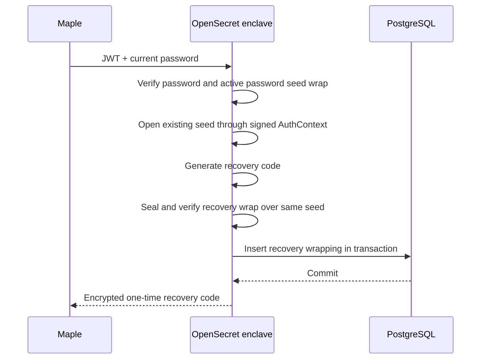
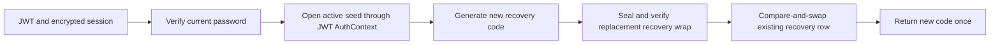
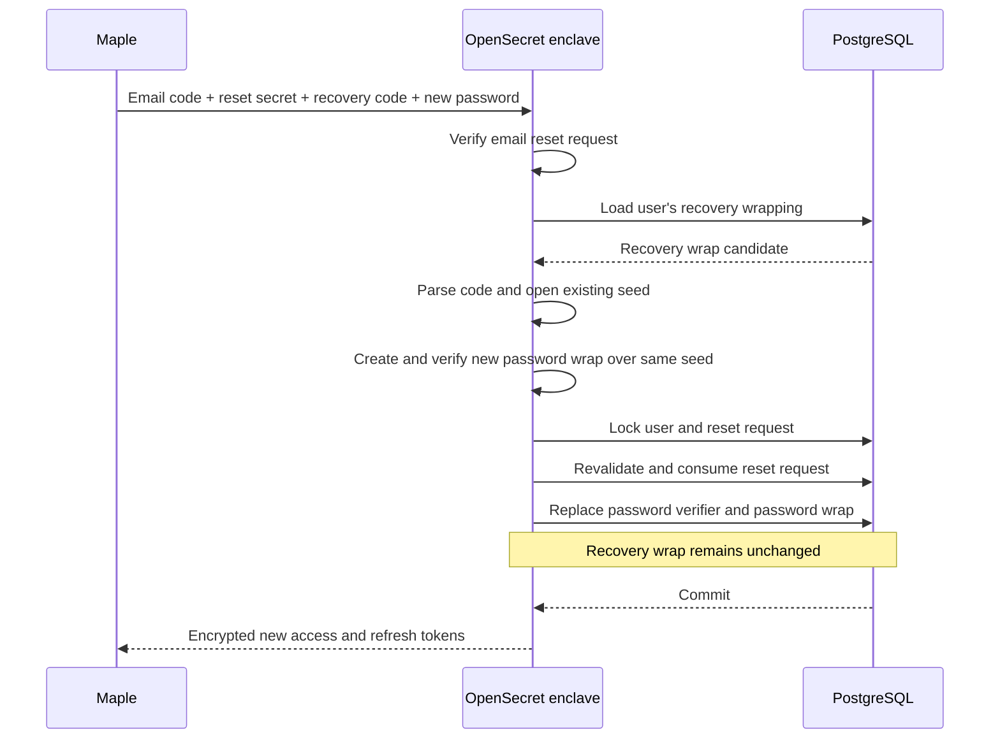
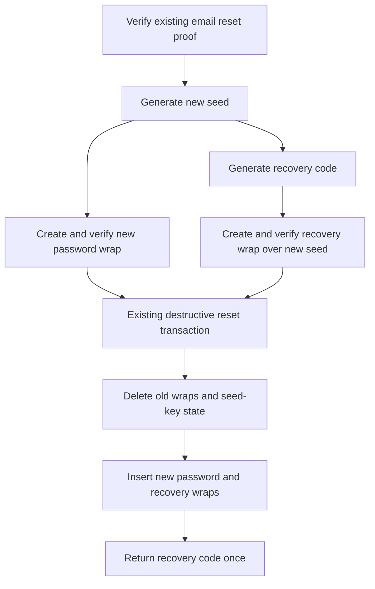

# Recovery Code Implementation Plan

## Scope

OpenSecret already supports credential-bound seed wraps for password and OAuth authentication. Password change rewraps the existing seed; password reset creates a new seed and deletes old seed-dependent state.

V1 adds a recovery credential kind to `user_seed_wrappings`. It does not otherwise redesign authentication, password-reset request handling, destructive-reset cleanup, OAuth, API keys, or token revocation.

## V1 Decisions

- One active recovery code per user.
- Recovery codes are opt-in from Maple's Security settings.
- Maple controls frontend rollout; no enclave/backend feature flag is required.
- V1 supports email-backed password users. Guest and OAuth-only recovery are deferred.
- The enclave generates 256 random bits and formats them as grouped Crockford Base32 with a 40-bit checksum.
- The code is visually distinct from a BIP-39 mnemonic and is shown only in an encrypted response.
- Enrollment activates the code immediately. The user does not re-enter it.
- Successful preserving recovery keeps the existing recovery code active.
- Rotation is explicit and requires an authenticated session plus current-password verification.
- A recovery attempt uses the existing email code and client reset secret. A failed recovery attempt consumes that reset request, so retry requires a new reset request.
- Current reset-request creation semantics remain unchanged: multiple unexpired reset requests may coexist until one reset succeeds.
- Password reset without a recovery code remains destructive exactly as today, except it also generates a recovery code and wraps the newly generated seed with it.
- V1 does not add broad OAuth or API-key revocation beyond current behavior.
- Complete, internally consistent database rollback remains outside the v1 threat model.

## Data Model

Extend the current credential kind:

```rust
enum CredentialKind {
    Password,
    OAuth,
    Recovery,
}

impl CredentialKind {
    fn as_str(self) -> &'static str {
        match self {
            Self::Password => "password",
            Self::OAuth => "oauth",
            Self::Recovery => "recovery",
        }
    }
}
```

Add a migration that extends the existing check constraint:

```sql
CHECK (credential_kind IN ('password', 'oauth', 'recovery'))
```

Reuse `user_seed_wrappings` without adding a recovery table:

```rust
struct UserSeedWrapping {
    id: i64,
    user_id: Uuid,
    credential_kind: String,
    credential_lookup_hash: Vec<u8>,
    wrapping_version: i16,
    seed_enc: Vec<u8>,
    created_at: DateTime<Utc>,
    updated_at: DateTime<Utc>,
}
```

For recovery, `credential_lookup_hash` identifies the user's single recovery slot. It is an enclave-keyed, domain-separated value derived from stable account context, not from the recovery secret:

```rust
fn recovery_credential_lookup_hash(
    enclave_root: &[u8],
    project_id: i32,
    user_id: Uuid,
) -> CredentialLookupHash;
```

The existing unique index then enforces one recovery wrap per user and wrapping version.

## Recovery Code

```rust
struct RecoveryCode {
    secret: Zeroizing<[u8; 32]>,
}

impl RecoveryCode {
    async fn generate(credentials: AwsCredentialManager) -> Self;
    fn parse(input: &str) -> Result<Self, RecoveryCodeError>;
    fn display(&self) -> Zeroizing<String>;
}
```

Canonical display shape:

```text
OSRC1-XXXX-XXXX-XXXX-XXXX-XXXX-XXXX-XXXX-XXXX-XXXX-XXXX-XXXX-XXXX-XXXX-CCCC-CCCC
```

- `OSRC1` identifies the display format.
- `X` groups encode the 256-bit secret using Crockford Base32.
- `C` groups encode a 40-bit checksum over the version and secret.
- Parsing is ASCII case-insensitive and ignores only ASCII spaces and hyphens.
- Reject invalid characters, length, version, padding, and checksum before database work.
- The recovery code never enters a path, query string, log, metric, email, AAD, or database column.

## Recovery Seed Wrap

Use recovery-specific domains while retaining the existing AEAD representation:

```text
12-byte nonce || ciphertext || 16-byte GCM tag
```

```rust
const RECOVERY_WRAP_ROOT_INFO: &[u8] = b"os.recovery-wrap-root.v1";
const RECOVERY_WRAP_KEY_INFO: &[u8] = b"os.recovery-wrap-aead-key.v1";
const RECOVERY_WRAP_DOMAIN: &str = "os.recovery-wrap.v1";

fn recovery_wrap_key(
    enclave_root: &[u8],
    recovery_secret: &[u8; 32],
) -> AeadKey {
    let root = hkdf(enclave_root, RECOVERY_WRAP_ROOT_INFO);
    hkdf_with_salt(&root, recovery_secret, RECOVERY_WRAP_KEY_INFO)
}

fn recovery_wrap_aad(
    user_id: Uuid,
    project_id: i32,
    wrapping_version: i16,
) -> Vec<u8> {
    CanonicalBytes::new(RECOVERY_WRAP_DOMAIN)
        .append_uuid(user_id)
        .append_i32(project_id)
        .append_str(CredentialKind::Recovery.as_str())
        .append_i16(wrapping_version)
        .into_bytes()
}
```

The enclave root and recovery secret are both required to open the envelope. User, project, credential kind, and wrapping version are authenticated through trusted AAD.

Every newly created recovery wrap must be opened and compared byte-for-byte with the intended seed before persistence.

Bound `seed_enc` before copying or decrypting it. Derive the exact maximum from the accepted mnemonic length plus nonce and tag.

## API Types

Names and paths may be adjusted with the SDK/Maple implementation, but the contracts should remain additive.

```rust
struct RecoveryStatusResponse {
    enrolled: bool,
    enrolled_at: Option<DateTime<Utc>>,
}

struct EnrollRecoveryRequest {
    current_password: String,
}

struct EnrollRecoveryResponse {
    recovery_code: String,
}

struct RotateRecoveryRequest {
    current_password: String,
}

struct RotateRecoveryResponse {
    recovery_code: String,
}

struct RecoveryPasswordResetRequest {
    email: String,
    alphanumeric_code: String,
    plaintext_secret: String,
    recovery_code: String,
    new_password: String,
    client_id: Uuid,
}

struct RecoveryPasswordResetResponse {
    message: String,
    access_token: String,
    refresh_token: String,
}

struct DestructivePasswordResetResponse {
    message: String,
    recovery_code: String,
}
```

Proposed routes:

```text
GET  /protected/recovery-code
POST /protected/recovery-code/enroll
POST /protected/recovery-code/rotate
POST /password-reset/recovery/confirm
```

Protected recovery management requires a user JWT and encrypted session. API keys cannot enroll or rotate recovery.

## Enrollment

Enrollment is available only when no recovery wrap exists.



Rust-like flow:

```rust
async fn enroll_recovery(
    user: User,
    auth_context: AuthContext,
    current_password: String,
) -> Result<RecoveryCode, ApiError> {
    require_email_password_user(&user)?;
    reauthenticate_password(&user, current_password).await?;

    let seed = decrypt_seed_for_auth_context(&user, &auth_context)?;
    ensure_no_recovery_wrap(user.uuid)?;

    let code = RecoveryCode::generate(...).await;
    let wrapping = new_recovery_seed_wrapping(&user, &code, &seed)?;
    verify_recovery_seed_wrapping(&user, &code, &seed, &wrapping)?;

    insert_recovery_wrap_if_absent(wrapping)?;
    Ok(code)
}
```

The insert must fail on a concurrent enrollment rather than silently replacing the winner.

## Manual Rotation

Rotation replaces the existing recovery wrap and returns a new code. The current recovery code is not required because the authenticated user proves control with their current password and active password seed wrap.



```rust
async fn rotate_recovery(
    user: User,
    auth_context: AuthContext,
    current_password: String,
) -> Result<RecoveryCode, ApiError> {
    require_email_password_user(&user)?;
    reauthenticate_password(&user, current_password).await?;

    let seed = decrypt_seed_for_auth_context(&user, &auth_context)?;
    let old = get_recovery_wrap(user.uuid)?.ok_or(ApiError::BadRequest)?;
    let code = RecoveryCode::generate(...).await;
    let replacement = new_recovery_seed_wrapping(&user, &code, &seed)?;
    verify_recovery_seed_wrapping(&user, &code, &seed, &replacement)?;

    replace_recovery_wrap_if_unchanged(old, replacement)?;
    Ok(code)
}
```

Future MFA may replace or supplement current-password step-up.

## Recovery-Preserving Password Reset

This flow verifies the existing email reset proof and recovery code, opens the existing seed, and creates a new password wrap over that same seed. The recovery wrap remains unchanged.



```rust
async fn confirm_recovery_password_reset(
    request: RecoveryPasswordResetRequest,
) -> Result<AuthResponse, ApiError> {
    let (user, reset_request) = verify_existing_reset_proof(
        request.email,
        request.alphanumeric_code,
        request.plaintext_secret,
        request.client_id,
    )?;

    let recovery_code = RecoveryCode::parse(&request.recovery_code)?;
    let recovery_wrap = get_recovery_wrap(user.uuid)?
        .ok_or(ApiError::BadRequest)?;

    let seed = decrypt_recovery_seed(&user, &recovery_code, &recovery_wrap)
        .map_err(|_| ApiError::BadRequest)?;
    validate_mnemonic(&seed)?;

    let new_password = new_password_verifier_and_wrap(&user, request.new_password, &seed).await?;
    verify_new_password_wrap(&user, &new_password, &seed)?;

    complete_preserving_password_reset(
        &user,
        &reset_request,
        &recovery_wrap,
        new_password,
    )?;

    issue_tokens_for_new_password_context(user, new_password.auth_context)
}
```

The transaction must:

1. Lock the user and selected reset request.
2. Recheck that the reset request is unused and unexpired.
3. Recheck the client reset-secret proof.
4. Recheck that the recovery wrap is unchanged from the opened candidate.
5. Consume the selected reset request and all other active reset requests, matching current successful-reset behavior.
6. Replace the encrypted password verifier and password wrap.
7. Leave the recovery wrap, OAuth behavior, API keys, and seed-key-encrypted data unchanged.

A failed recovery-code parse or unwrap must consume the selected reset request atomically. The user must request a new email reset code before retrying. Public errors must not reveal which factor failed.

## Destructive Password Reset

The existing `/password-reset/confirm` flow remains destructive. It continues to generate a new seed, delete old wraps and seed-key-encrypted state, disconnect OAuth, preserve API keys, and install a new password wrap as it does today.

The only addition is a recovery wrap over the same newly generated seed:



```rust
async fn confirm_destructive_password_reset(...) -> Result<DestructivePasswordResetResponse, ApiError> {
    let reset = verify_existing_reset_proof(...)?;
    let seed = generate_twelve_word_seed(...).await?;

    let password = new_password_verifier_and_wrap(&reset.user, new_password, seed.as_bytes()).await?;
    verify_new_password_wrap(&reset.user, &password, seed.as_bytes())?;

    let recovery_code = RecoveryCode::generate(...).await;
    let recovery_wrap = new_recovery_seed_wrapping(&reset.user, &recovery_code, seed.as_bytes())?;
    verify_recovery_seed_wrapping(&reset.user, &recovery_code, seed.as_bytes(), &recovery_wrap)?;

    complete_destructive_password_reset(
        &reset.user,
        &reset.request,
        password,
        recovery_wrap,
    )?;

    Ok(DestructivePasswordResetResponse {
        message: "Password reset successful".into(),
        recovery_code: recovery_code.display().to_string(),
    })
}
```

The password and recovery wraps must be inserted in the existing destructive-reset transaction. Failure to build either wrap leaves current account state unchanged.

## Concurrency Rules

- Enrollment inserts only if no recovery wrap exists.
- Rotation replaces only the exact recovery row observed before encryption.
- Preserving reset commits only if the opened recovery row is still current.
- Password change, recovery reset, destructive reset, enrollment, and rotation must use a consistent user-row lock/CAS order.
- New wraps are verified before entering the transaction.
- No unwrap failure generates a seed or falls through to destructive reset.

## Focused Tests

### Cryptography

- Recovery code format/checksum vectors and normalization.
- Recovery wrap round trip.
- Wrong recovery code rejection.
- Ciphertext, nonce, tag, AAD, root-key, user, project, kind, and version substitution rejection.
- Password/OAuth/recovery domain separation.
- Oversized or malformed envelope rejection before decryption.

### Database lifecycle

- Enrollment creates one recovery wrap over the existing seed.
- Concurrent enrollment has one winner.
- Rotation preserves the seed, replaces the wrap, and invalidates the old code.
- Preserving reset keeps the seed/private key and existing encrypted data unchanged.
- Preserving reset leaves the recovery wrap byte-for-byte unchanged.
- A failed recovery attempt consumes only its selected reset request; other currently valid reset requests retain current behavior.
- Successful preserving reset consumes all active reset requests, matching current reset behavior.
- Destructive reset retains all current deletion and credential behavior, creates a new seed, and inserts password and recovery wraps over that same seed.
- Recovery reset races safely with password change, enrollment, rotation, and destructive reset.
- Copied recovery wraps fail across users and projects.

### Encrypted API

- Recovery management rejects API-key and unauthenticated contexts.
- Guest and OAuth-only users cannot enroll or recover in v1.
- Success responses are encrypted and errors are sanitized.
- Recovery codes, seeds, verifiers, decrypted payloads, and ciphertext do not enter logs.
- Old clients continue using existing login and reset contracts; the destructive reset response change must be coordinated with SDK/Maple decoding.

## Frontend Rollout

Maple exposes recovery enrollment through a feature-flagged Security settings UI. OpenSecret does not need a backend feature flag; the additive endpoints remain unused by clients that do not expose the feature.

## Deferred Work

- Protective recovery that rejects destructive reset without the recovery code.
- Multiple recovery credentials and per-credential lifecycle history.
- Automatic rotation after recovery.
- MFA-gated enrollment or rotation.
- Recovery for guest and OAuth-only users.
- Broad OAuth/API-key revocation after preserving recovery.
- Changes to reset-request multiplicity.
- Retaining old encrypted vaults or seed identities after destructive reset.
